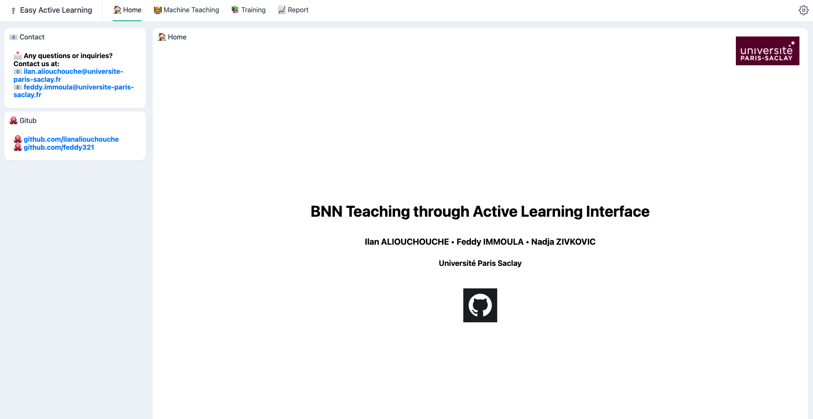
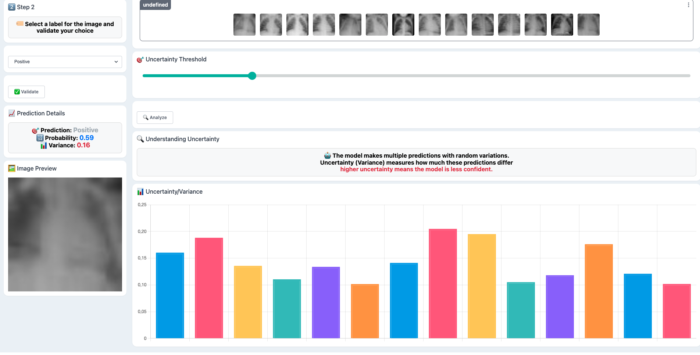
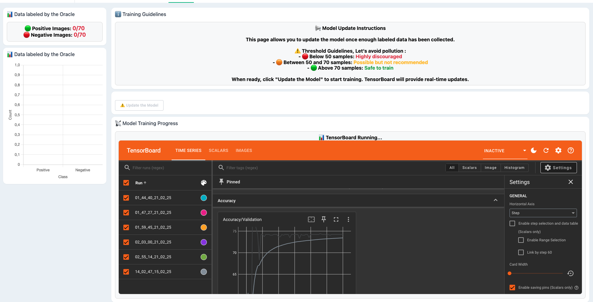
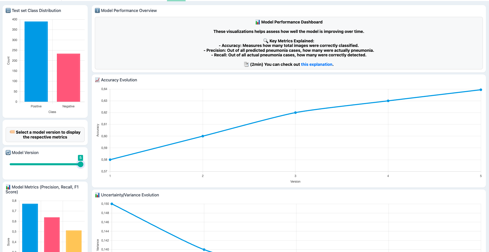

# Model Teaching in Health With BNN and Active Learning

This project aims to integrate domain knowledge with deep learning through an intuitive interface designed for medical professionals. It leverages the [Marcelle](https://marcelle.dev/) package, developed by researchers at LISN, to create a user-friendly experience.

## Technologies Used

- **[Marcelle](https://marcelle.dev/)**: A JavaScript package for interactive machine learning, facilitating the development of intuitive interfaces.
- **[FastAPI](https://fastapi.tiangolo.com/)**: A modern web framework for building APIs with Python.
- **Bayesian Neural Networks (BNN)**: A combination of pre-trained Convolutional Neural Networks (CNN) and Bayesian Neural Networks for robust model training.

## Objective

The primary goal of this project is to combine domain expertise with deep learning techniques, making advanced machine learning models accessible and usable by medical professionals through a highly intuitive interface.

## How It Works

1. **Active Learning & Model Teaching**: The user/oracle (a doctor) labels uncertain predictions, helping refine the Bayesian Neural Network over time.
2. **Model Retraining**: Newly labeled data is incorporated into the training set, and the model is retrained through the interface.
3. **Performance Visualization**: The interface provides real-time feedback with performance metrics, uncertainty visualization, and interactive charts.
4. **TensorBoard Integration**: Training logs and model evolution can be monitored live via TensorBoard.

## App Overview

The application consists of three main tabs (+ home), allowing the user to interact with different aspects of the model:

- **Home**  
  

- **Machine Teaching**  
  

- **Training**  
  

- **Report**  
  

## Project Structure

- **`app/`**: Contains the frontend application built with the IML Marcelle package.
- **`ml/`**: Machine learning scripts for data collection, model training, and inference.
- **`checkpoints/`**: Directory for storing model checkpoints.
- **`fastapi_app.py`**: The backend application using FastAPI.

## Get Started

Follow these steps to set up and run the project.

### 1. Clone the Repository

```bash
git clone https://github.com/ilanaliouchouche/Model-Teaching-in-Health-With-BNN-and-Active-Learning.git 
cd Model-Teaching-in-Health-With-BNN-and-Active-Learning
```

### 2. Install the Python Dependencies

```bash
pip install -e .
```

### 3. Collect the data 
```bash
python ml/collect_data.py
```

### 4. Start the Backend API

```bash
python fastapi_app.py
```

### Install & Run the Marcelle app (In an other terminal)

```bash
cd app/app
npm install
npm run dev
```